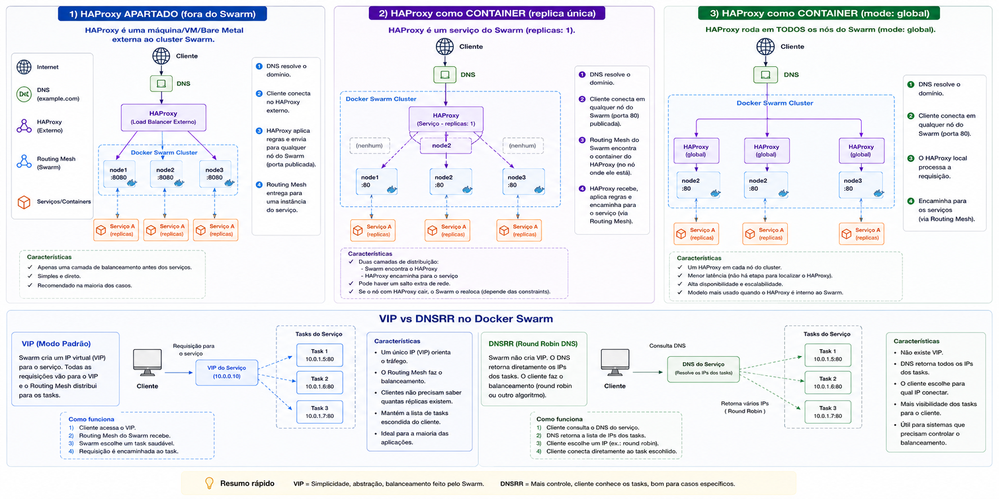
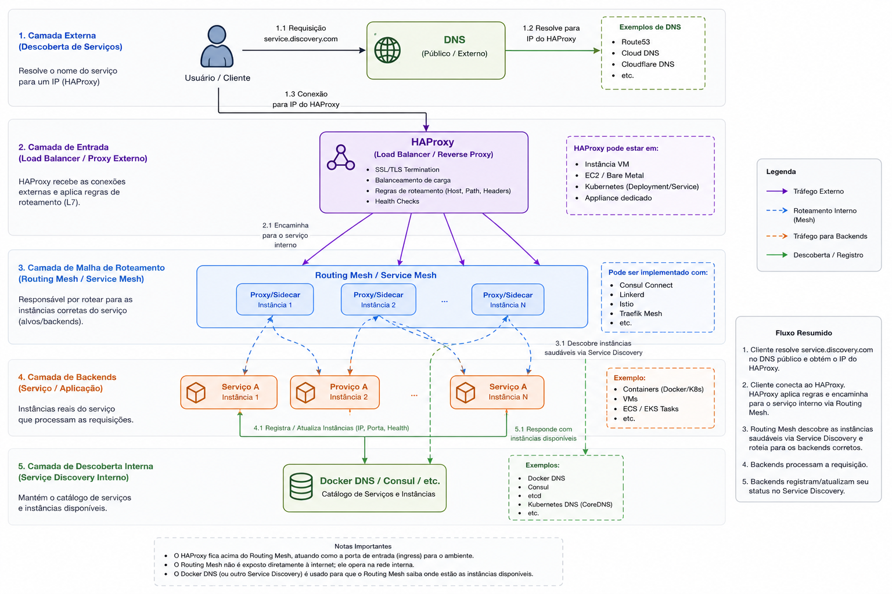

# 12 — Docker Swarm: VIP, DNSRR e HAProxy global

Extensão do laboratório Swarm ([módulo 11](../11-docker-swarm/)): compara **endpoint modes** (`vip` vs `dnsrr`) e implanta um **HAProxy em modo global** para balancear tráfego entre as réplicas do nginx na rede overlay.

## O que este módulo demonstra

- Rede overlay **attachable** (`ha-proxy`)
- Diferença entre **VIP** e **DNSRR** no endpoint de um serviço
- HAProxy com resolução DNS dinâmica via `tasks.<serviço>`
- Serviço Swarm em modo **global** (uma instância por nó)
- Publicação de porta em modo **host** (`mode=host`)
- Balanceamento real entre tasks (não apenas routing mesh do Swarm)

## Arquitetura

### Visão geral

```text
                    rede overlay: ha-proxy
┌─────────────────────────────────────────────────────────────────────┐
│                                                                     │
│  node-1 (192.168.56.11)    node-2 (.12)         node-3 (.13)       │
│  ┌──────────────────┐      ┌──────────────────┐  ┌──────────────────┐
│  │ haproxy (global) │      │ haproxy (global) │  │ haproxy (global) │
│  │ :80 host mode    │      │ :80 host mode    │  │ :80 host mode    │
│  └────────┬─────────┘      └────────┬─────────┘  └────────┬─────────┘
│           │                         │                      │         │
│           └─────────────┬───────────┴──────────────────────┘         │
│                         │  balance roundrobin                        │
│                         ▼                                            │
│              tasks.nginx-service (DNSRR)                             │
│              ┌──────┐  ┌──────┐  ┌──────┐                            │
│              │nginx │  │nginx │  │nginx │  (--replicas 3)            │
│              │task 1│  │task 2│  │task 3│                            │
│              └──────┘  └──────┘  └──────┘                            │
└─────────────────────────────────────────────────────────────────────┘

Cliente externo
      │
      │  curl 192.168.56.11:80  (ou .12 / .13)
      ▼
  HAProxy no nó local → backends nginx via DNS
```

### VIP vs DNSRR

Quando um serviço é criado na rede overlay, o Swarm define como outros containers (ou o routing mesh) alcançam as **tasks**:

| Modo | Como funciona | Nome resolve para | Balanceamento |
|------|---------------|-------------------|---------------|
| **vip** (padrão) | Swarm atribui um **IP virtual** ao serviço | Um único VIP | Feito pelo **IPVS** interno do Swarm |
| **dnsrr** | Sem VIP; DNS retorna os IPs das tasks | Múltiplos A records (round robin DNS) | Responsabilidade do **cliente** (ex.: HAProxy) |

```text
VIP:
  nginx-service  →  10.0.1.50 (VIP)  →  Swarm distribui para tasks

DNSRR:
  tasks.nginx-service  →  10.0.1.12, 10.0.1.34, 10.0.1.56  →  cliente escolhe o backend
```

> Para balanceamento externo com HAProxy, use **dnsrr**. Com VIP, o HAProxy veria um único IP e o Swarm faria o balanceamento por baixo — anulando o controle do proxy.



### Por que `tasks.nginx-service`?

No Swarm, o nome `nginx-service` resolve para o endpoint do serviço (VIP ou entrada do serviço). O prefixo **`tasks.`** resolve diretamente para os IPs de **cada task em execução** — necessário para o `server-template` do HAProxy descobrir backends dinamicamente quando réplicas sobem/descem.

### HAProxy global + publish host

| Opção | Efeito |
|-------|--------|
| `--mode global` | Uma task do HAProxy em **cada nó** do cluster |
| `--publish mode=host` | Porta 80 do container mapeada para a porta 80 **do host** (sem routing mesh) |
| `bind` mount `/etc/haproxy` | Config local em cada nó (mesmo arquivo em todos) |

Com isso, `curl` em qualquer IP de nó (`192.168.56.11`, `.12`, `.13`) atinge o HAProxy **daquele nó**, que balanceia entre as tasks nginx na overlay.



### Resolução DNS no HAProxy

O [haproxy.cfg](haproxy.cfg) usa o DNS embutido do Docker (`127.0.0.11:53`):

```text
resolvers docker → nameserver 127.0.0.11:53

server-template nginx- 20 tasks.nginx-service:80 \
  resolvers docker init-addr libc,none
```

- **`server-template`**: cria até 20 slots de servidor a partir do DNS
- **`init-addr libc,none`**: não falha se o DNS ainda não retornou IPs na subida
- **`check`**: health check HTTP nas tasks

Stats disponíveis em `http://<qualquer-nó>:80/my-stats`.

## Pré-requisitos

- [Vagrant](https://www.vagrantup.com/) e [VirtualBox](https://www.virtualbox.org/)
- ~3 GB de RAM livre (3 VMs × 1 GB)
- Arquivo [haproxy.cfg](haproxy.cfg) copiado para `/etc/haproxy/haproxy.cfg` em **cada nó** (passo do lab)

> Este módulo é **autocontido**: inclui `Vagrantfile` e todos os passos para subir o cluster. Não é necessário ter feito o [módulo 11](../11-docker-swarm/) antes — a infraestrutura é a mesma.

## Subir o cluster Swarm

Guia detalhado também em [docs/guias/swarm-cluster-setup.md](../docs/guias/swarm-cluster-setup.md).

### 1. VMs

```bash
cd 12-docker-swarm-ha-proxy
vagrant up
```

| VM | Hostname | IP | Papel |
|----|----------|-----|-------|
| `swarm-1` | `node-1` | `192.168.56.11` | Manager |
| `swarm-2` | `node-2` | `192.168.56.12` | Worker |
| `swarm-3` | `node-3` | `192.168.56.13` | Worker |

### 2. Inicializar o Swarm (manager — `swarm-1`)

```bash
vagrant ssh swarm-1
docker swarm init --advertise-addr 192.168.56.11
docker node ls
```

### 3. Expor API Docker na porta 2375 (manager)

Editar `/lib/systemd/system/docker.service`:

```ini
ExecStart=/usr/bin/dockerd -H fd:// -H tcp://0.0.0.0:2375
```

```bash
sudo systemctl daemon-reload
sudo systemctl restart docker
ss -lnp | grep 2375
```

### 4. Workers (`swarm-2` e `swarm-3`)

No manager: `docker swarm join-token worker`

Em cada worker:

```bash
docker swarm join --token <WORKER_TOKEN> 192.168.56.11:2377
```

### 5. Cliente remoto (máquina host)

```bash
export DOCKER_HOST=192.168.56.11:2375
docker node ls   # deve listar 3 nós
```

## Passo a passo do laboratório

Comandos organizados em [commands.bash](commands.bash). Com o cluster no ar, continue com:

### 1. Rede overlay

```bash
export DOCKER_HOST=192.168.56.11:2375

docker network create -d overlay --attachable ha-proxy
```

A flag `--attachable` permite containers avulsos (ex.: `netshoot`, validação do haproxy) entrarem na rede.

### 2. Explorar VIP, depois DNSRR

```bash
# Criar com VIP (padrão)
docker service create \
  --name nginx-service --replicas 3 \
  --endpoint-mode vip --network ha-proxy \
  nginx:latest

docker service inspect nginx-service \
  --format 'Endpoint mode: {{.Endpoint.Spec.Mode}} | VIPs: {{json .Endpoint.VirtualIPs}}'

# Alternar para DNSRR
docker service update --endpoint-mode dnsrr nginx-service
```

Ou recriar direto em DNSRR (fluxo usado com HAProxy):

```bash
docker service create \
  --name nginx-service --replicas 3 \
  --endpoint-mode dnsrr --network ha-proxy \
  nginx:latest
```

### 3. Configurar HAProxy em cada nó

Em `swarm-1`, `swarm-2` e `swarm-3`:

```bash
sudo mkdir -p /etc/haproxy
sudo cp haproxy.cfg /etc/haproxy/haproxy.cfg   # conteúdo deste repositório
```

### 4. Validar e criar serviço global

```bash
docker run --rm \
  --network ha-proxy \
  --mount type=bind,src=/etc/haproxy,dst=/usr/local/etc/haproxy,ro=true \
  haproxytech/haproxy-debian:2.0 \
  haproxy -c -f /usr/local/etc/haproxy/haproxy.cfg

docker service create \
  --mode global \
  --name haproxy-service \
  --network ha-proxy \
  --publish published=80,target=80,protocol=tcp,mode=host \
  --mount type=bind,src=/etc/haproxy,dst=/usr/local/etc/haproxy,ro=true \
  haproxytech/haproxy-debian:2.0
```

> O caminho de destino do mount deve ser `/usr/local/etc/haproxy` nesta imagem (não `/etc/haproxy`).

### 5. Testar balanceamento

```bash
curl 192.168.56.11:80
curl 192.168.56.12:80
curl 192.168.56.13:80

docker service update --replicas 5 nginx-service
docker service update --replicas 3 nginx-service
```

### 6. Debug DNS (opcional)

```bash
docker run --network ha-proxy -it nicolaka/netshoot
# nslookup tasks.nginx-service
```

Compare com `nginx-service` (sem `tasks.`) em VIP vs DNSRR.

## Comandos úteis

```bash
docker service ps nginx-service
docker service ps haproxy-service
docker service logs -f nginx-service
docker service logs haproxy-service --raw --tail 100
```

## Limpeza

```bash
export DOCKER_HOST=192.168.56.11:2375
docker service rm haproxy-service nginx-service
docker network rm ha-proxy

vagrant halt          # desliga VMs
vagrant destroy -f    # remove VMs
```

## Próximo passo

- [Módulo 13 — DNS externo (BIND) + nginx](../13-docker-swarm-dns/) — abordagem alternativa: balanceamento via DNS round robin nos IPs dos nós + routing mesh do Swarm (sem HAProxy).

## Referências

- [Subir o cluster Swarm](../docs/guias/swarm-cluster-setup.md) — guia compartilhado (módulos 11, 12 e 13)
- [Docker Swarm — routing mesh e endpoint modes](https://docs.docker.com/engine/swarm/networking/)
- [Publish ports — host mode](https://docs.docker.com/engine/swarm/services/#publish-a-services-ports)
- [HAProxy server-template + DNS resolvers](https://www.haproxy.com/documentation/haproxy-configuration-tutorials/load-balancing/simple-configuration/)
