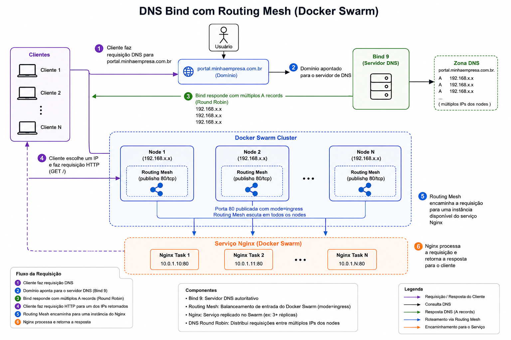

# 13 — Docker Swarm: DNS externo (BIND) + nginx

Extensão do laboratório Swarm ([módulo 11](../11-docker-swarm/)): um servidor **BIND9** resolve `portal.minhaempresa.com.br` para os IPs dos nós do cluster, e o **routing mesh** do Swarm entrega o tráfego às réplicas do nginx.

Abordagem alternativa ao [módulo 12](../12-docker-swarm-ha-proxy/) — lá o balanceamento é feito pelo **HAProxy**; aqui é feito em duas camadas: **DNS round robin** (escolha do nó) + **ingress do Swarm** (entrega à task).

## O que este módulo demonstra

- Servidor DNS autoritativo com **BIND9** em container
- Zona DNS customizada (`minhaempresa.com.br`)
- Múltiplos registros **A** para o mesmo hostname (DNS round robin)
- Publicação de porta do serviço Swarm (`--publish 80:80`)
- **Routing mesh** — qualquer nó responde na porta publicada
- Resolução e acesso por nome (`curl portal.minhaempresa.com.br`)

## Arquitetura

### Visão geral

```text
  máquina host (cliente)
  ┌────────────────────────────────────────────────────────────┐
  │  /etc/resolv.conf  →  IP do BIND                         │
  │                                                            │
  │  ┌─────────────────────┐                                 │
  │  │  bind9:demo         │  zona: minhaempresa.com.br       │
  │  │  :53                │                                 │
  │  └──────────┬──────────┘                                 │
  │             │  portal.minhaempresa.com.br                  │
  │             │    A  192.168.56.11                          │
  │             │    A  192.168.56.12   ← DNS round robin      │
  │             │    A  192.168.56.13                          │
  └─────────────┼──────────────────────────────────────────────┘
                │
                │  curl portal.minhaempresa.com.br:80
                ▼
  rede 192.168.56.0/24
  ┌────────────────────────────────────────────────────────────┐
  │  node-1 (.11)      node-2 (.12)      node-3 (.13)          │
  │                                                            │
  │  routing mesh :80  ←── nginx-service (--replicas 3)        │
  │                      rede overlay: dns-overlay             │
  └────────────────────────────────────────────────────────────┘
```

### Como o tráfego flui

```text
1. Cliente pergunta ao BIND: "qual o IP de portal.minhaempresa.com.br?"
2. BIND responde com um dos A records (.11, .12 ou .13) — round robin DNS
3. Cliente conecta em <IP-do-nó>:80
4. Routing mesh do Swarm encaminha para uma task do nginx-service
```



### DNS round robin vs HAProxy (módulo 12)

| Aspecto | Módulo 13 (BIND) | Módulo 12 (HAProxy) |
|---------|------------------|---------------------|
| Balanceamento | DNS escolhe o **nó** | HAProxy escolhe a **task** |
| Componente extra | Container BIND no host | Serviço global HAProxy em cada nó |
| Endpoint nginx | VIP + `--publish 80:80` | DNSRR (sem publish direto) |
| Health check | Não (DNS não sabe se nginx caiu) | Sim (`option httpchk`) |
| Complexidade | Menor | Maior, porém mais controle |

### Arquivos BIND

| Arquivo | Função |
|---------|--------|
| [bind/Dockerfile](bind/Dockerfile) | Imagem Ubuntu + BIND9 |
| [bind/named.conf.options](bind/named.conf.options) | Recursão, forwarders (8.8.8.8) |
| [bind/named.conf.local](bind/named.conf.local) | Declaração da zona |
| [bind/db.minhaempresa.com.br](bind/db.minhaempresa.com.br) | Registros NS e A |

Registros principais na zona:

```text
ns1.minhaempresa.com.br.     A  172.20.0.2        # IP do container BIND
portal.minhaempresa.com.br.   A  192.168.56.11     # nós do Swarm
portal.minhaempresa.com.br.   A  192.168.56.12
portal.minhaempresa.com.br.   A  192.168.56.13
```

> O IP `172.20.0.2` do `ns1` é o IP do container na rede bridge padrão. Se o IP mudar após recriar o container, atualize o zone file.

## Pré-requisitos

- [Vagrant](https://www.vagrantup.com/) e [VirtualBox](https://www.virtualbox.org/)
- ~3 GB de RAM livre (3 VMs × 1 GB)
- Docker instalado na máquina host (para o container BIND)

> Este módulo é **autocontido**: inclui `Vagrantfile` e todos os passos para subir o cluster. Não é necessário ter feito os módulos [11](../11-docker-swarm/) ou [12](../12-docker-swarm-ha-proxy/) antes.

## Subir o cluster Swarm

Guia detalhado também em [docs/guias/swarm-cluster-setup.md](../docs/guias/swarm-cluster-setup.md).

### 1. VMs

```bash
cd 13-docker-swarm-dns
vagrant up
```

| VM | Hostname | IP | Papel |
|----|----------|-----|-------|
| `swarm-1` | `node-1` | `192.168.56.11` | Manager |
| `swarm-2` | `node-2` | `192.168.56.12` | Worker |
| `swarm-3` | `node-3` | `192.168.56.13` | Worker |

### 2. Inicializar o Swarm (manager — `swarm-1`)

```bash
vagrant ssh swarm-1
docker swarm init --advertise-addr 192.168.56.11
docker node ls
```

### 3. Expor API Docker na porta 2375 (manager)

Editar `/lib/systemd/system/docker.service`:

```ini
ExecStart=/usr/bin/dockerd -H fd:// -H tcp://0.0.0.0:2375
```

```bash
sudo systemctl daemon-reload
sudo systemctl restart docker
ss -lnp | grep 2375
```

### 4. Workers (`swarm-2` e `swarm-3`)

No manager: `docker swarm join-token worker`

Em cada worker:

```bash
docker swarm join --token <WORKER_TOKEN> 192.168.56.11:2377
```

### 5. Cliente remoto (máquina host)

```bash
export DOCKER_HOST=192.168.56.11:2375
docker node ls   # deve listar 3 nós
```

## Passo a passo do laboratório

Comandos organizados em [commands.bash](commands.bash). Com o cluster no ar, continue com:

### 1. Build e subir o BIND (máquina host)

```bash
docker build -t bind9:demo bind/

docker run -d --name bind-dns \
  -p 53:53/udp -p 53:53/tcp \
  bind9:demo

docker exec -d bind-dns /etc/init.d/bind9 start
```

### 2. Apontar resolv.conf para o BIND

```bash
# descobrir IP do container (se não publicou porta 53)
docker inspect -f '{{range .NetworkSettings.Networks}}{{.IPAddress}}{{end}}' bind-dns

# editar resolv.conf (requer sudo no host)
sudo vi /etc/resolv.conf
# nameserver 127.0.0.1        # se publicou -p 53:53
# nameserver 172.20.0.2       # ou IP do container
```

### 3. Testar resolução DNS

```bash
host portal.minhaempresa.com.br
# portal.minhaempresa.com.br has address 192.168.56.11
# portal.minhaempresa.com.br has address 192.168.56.12
# portal.minhaempresa.com.br has address 192.168.56.13

nc -v portal.minhaempresa.com.br 80
curl portal.minhaempresa.com.br
```

### 4. Criar nginx no Swarm (cliente remoto)

```bash
export DOCKER_HOST=192.168.56.11:2375

# rede overlay (se ainda não existir)
docker network create -d overlay --attachable dns-overlay

docker service create \
  --replicas 3 \
  --network dns-overlay \
  --name nginx-service \
  --publish 80:80 \
  nginx:latest

docker service ls
docker service ps nginx-service
```

### 5. Validar acesso por nome

```bash
curl portal.minhaempresa.com.br
# repetir — DNS pode retornar IPs diferentes (round robin)
```

## Comandos úteis

```bash
docker exec -it bind-dns /bin/sh          # shell no BIND
docker service logs -f nginx-service
docker service scale nginx-service=5
```

## Limpeza

```bash
export DOCKER_HOST=192.168.56.11:2375
docker service rm nginx-service

docker stop bind-dns && docker rm bind-dns
# restaurar /etc/resolv.conf original do host

vagrant halt          # desliga VMs
vagrant destroy -f    # remove VMs
```

## Referências

- [Subir o cluster Swarm](../docs/guias/swarm-cluster-setup.md) — guia compartilhado (módulos 11, 12 e 13)
- [Docker Swarm — routing mesh](https://docs.docker.com/engine/swarm/ingress/)
- [BIND9 Administrator Reference Manual](https://bind9.readthedocs.io/)
- [Módulo 12 — HAProxy global](../12-docker-swarm-ha-proxy/) — abordagem alternativa de balanceamento
