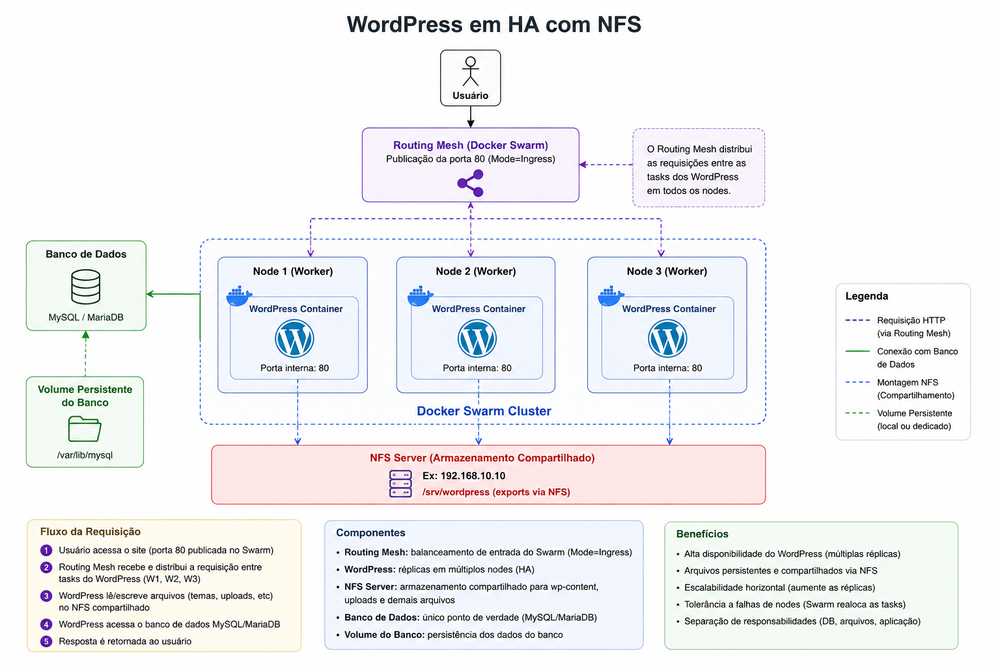

# 15 — Docker Swarm: WordPress em HA com NFS

Evolução do [módulo 14](../14-docker-swarm-stacks/) (Stacks): o **WordPress** roda com **5 réplicas** no Swarm e todas compartilham o mesmo diretório `wp-content` via um servidor **NFS** dedicado — garantindo que uploads e temas estejam disponíveis em qualquer nó onde uma task for alocada.

O **MySQL** é fixado em um nó específico via **placement constraint** (`node.labels.db==true`), isolando o banco de dados das réplicas de aplicação.

## O que este módulo demonstra

- Volume NFS em stack Swarm (`driver_opts` com `type: nfs`)
- Alta disponibilidade do WordPress com múltiplas réplicas
- **Placement constraints** para fixar o banco em um nó dedicado
- Rede overlay **criptografada** (`driver_opts.encrypted: "true"`)
- Separação de infraestrutura: VM NFS isolada do cluster Swarm
- Labels de nó (`docker node update --label-add`)

## Arquitetura

### Visão geral

```text
  cliente (navegador)
  ┌────────────────────────────────────────────────────────────┐
  │           http://192.168.56.11:80                          │
  └─────────────────────┬──────────────────────────────────────┘
                        │
                        ▼
  Docker Swarm Cluster (192.168.56.11–13)
  ┌────────────────────────────────────────────────────────────┐
  │                                                            │
  │   node-1 (.11) ┐                                          │
  │   node-2 (.12) ├── routing mesh :80                       │
  │   node-3 (.13) ┘     │                                    │
  │                       ▼                                    │
  │   ┌──────────────────────────────────────────┐            │
  │   │  frontend — wordpress:latest             │            │
  │   │  réplicas: 5  │  porta 80:80             │            │
  │   │  volume: wordpress_data (NFS mount)      │            │
  │   └──────────────────┬───────────────────────┘            │
  │                      │  wordpress-overlay (encrypted)     │
  │   ┌──────────────────▼───────────────────────┐            │
  │   │  db — mysql:5.7                          │            │
  │   │  réplicas: 1  │  node.labels.db==true    │            │
  │   │  volume: db_data (local)                 │            │
  │   └──────────────────────────────────────────┘            │
  │                                                            │
  └────────────────────────────────────────────────────────────┘
                        │
                        │  NFS mount (/srv/wordpress)
                        ▼
  VM NFS (192.168.56.20)
  ┌────────────────────────────────────────────────────────────┐
  │  nfs-kernel-server                                         │
  │  export: /srv/wordpress → 192.168.56.0/24                  │
  └────────────────────────────────────────────────────────────┘
```

### Como o tráfego flui

```text
1. Cliente acessa 192.168.56.11:80 (ou .12 / .13 — routing mesh)
2. Routing mesh encaminha para uma das 5 tasks do frontend
3. WordPress lê/escreve wp-content via volume NFS (192.168.56.20)
4. WordPress consulta o MySQL via rede overlay criptografada
5. Resposta retornada ao cliente
```



### Infraestrutura de VMs

| VM | IP | Papel |
|----|-----|-------|
| NFS server | `192.168.56.20` | Servidor NFS — `nfs/Vagrantfile` |
| `swarm-1` / `node-1` | `192.168.56.11` | Manager do Swarm |
| `swarm-2` / `node-2` | `192.168.56.12` | Worker |
| `swarm-3` / `node-3` | `192.168.56.13` | Worker (com label `db=true`) |

### Volumes

| Volume | Tipo | Montagem |
|--------|------|---------|
| `wordpress_data` | NFS | `192.168.56.20:/srv/wordpress` → `/var/www/html` |
| `db_data` | Local | `/var/lib/mysql` no nó com label `db=true` |

## Pré-requisitos

- [Vagrant](https://www.vagrantup.com/) e [VirtualBox](https://www.virtualbox.org/)
- ~4 GB de RAM livre (1 VM NFS + 3 VMs Swarm × 1 GB)
- Guia de setup do cluster: [docs/guias/swarm-cluster-setup.md](../docs/guias/swarm-cluster-setup.md)

## Passo a passo do laboratório

### 1. Subir o servidor NFS

```bash
cd 15-docker-swarm-nfs/nfs
vagrant up
```

O Vagrantfile instala `nfs-kernel-server` e exporta `/srv/wordpress` para a rede `192.168.56.0/24`.

### 2. Subir o cluster Swarm

```bash
cd ../swarm
vagrant up
```

### 3. Inicializar o Swarm (manager — `swarm-1`)

```bash
vagrant ssh swarm-1
docker swarm init --advertise-addr 192.168.56.11
docker swarm join-token worker   # copiar o token
```

### 4. Adicionar os workers

Em `swarm-2` e `swarm-3`:

```bash
docker swarm join --token <WORKER_TOKEN> 192.168.56.11:2377
```

### 5. Adicionar label ao nó do banco

O MySQL será fixado no `node-3`. Na máquina host:

```bash
export DOCKER_HOST=192.168.56.11:2375

# descobrir o ID do node-3
docker node ls

docker node update --label-add db=true <ID-do-node-3>
docker node inspect <ID-do-node-3> --pretty | grep Labels
```

### 6. Verificar o volume NFS (opcional)

```bash
docker volume create \
  --driver local \
  --opt type=nfs4 \
  --opt o=addr=192.168.56.20,rw,nolock \
  --opt device=:/srv/wordpress \
  wordpress

docker run --rm -v wordpress:/var/www/html wordpress:latest ls /var/www/html
```

### 7. Fazer o deploy do stack

```bash
export DOCKER_HOST=192.168.56.11:2375

docker stack deploy -c wordpress/docker-compose.yaml wp-stack
```

### 8. Verificar o estado do stack

```bash
docker stack services wp-stack
# NAME              MODE         REPLICAS
# wp-stack_db       replicated   1/1
# wp-stack_frontend replicated   5/5

docker stack ps wp-stack
```

### 9. Acessar o WordPress

```bash
# Abra no navegador:
http://192.168.56.11:80
```

> Graças ao **routing mesh**, qualquer nó responde — `192.168.56.12` e `192.168.56.13` também funcionam.

## Comandos úteis

```bash
export DOCKER_HOST=192.168.56.11:2375

# escalar o frontend
docker service scale wp-stack_frontend=3

# ver em qual nó o banco está rodando
docker service ps wp-stack_db

# logs do frontend
docker service logs -f wp-stack_frontend

# inspecionar o volume NFS
docker volume inspect wordpress_data
```

## Limpeza

```bash
export DOCKER_HOST=192.168.56.11:2375

# remover o stack
docker stack rm wp-stack

# remover volumes
docker volume rm wp-stack_wordpress_data wp-stack_db_data

# desligar VMs
cd swarm && vagrant halt && vagrant destroy -f
cd ../nfs && vagrant halt && vagrant destroy -f
```

## Referências

- [Subir o cluster Swarm](../docs/guias/swarm-cluster-setup.md) — guia compartilhado
- [Docker Volumes com NFS](https://docs.docker.com/engine/storage/volumes/#create-a-service-which-creates-an-nfs-volume)
- [Docker Swarm — placement constraints](https://docs.docker.com/engine/swarm/services/#placement-constraints)
- [Módulo 14 — Docker Swarm Stacks](../14-docker-swarm-stacks/) — base deste módulo
